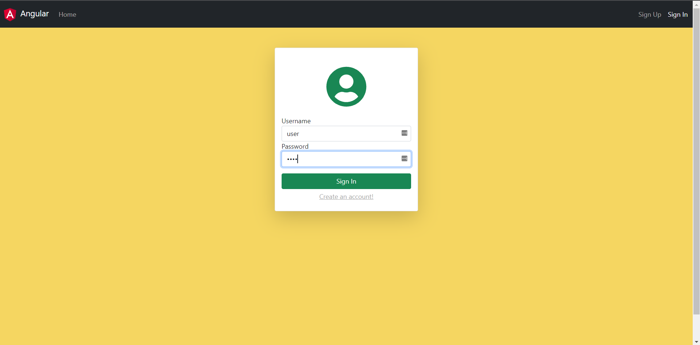
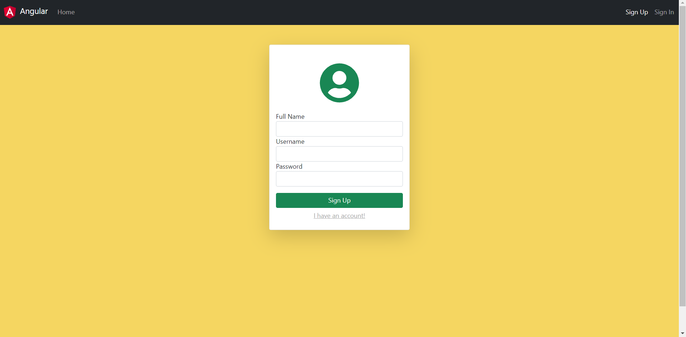
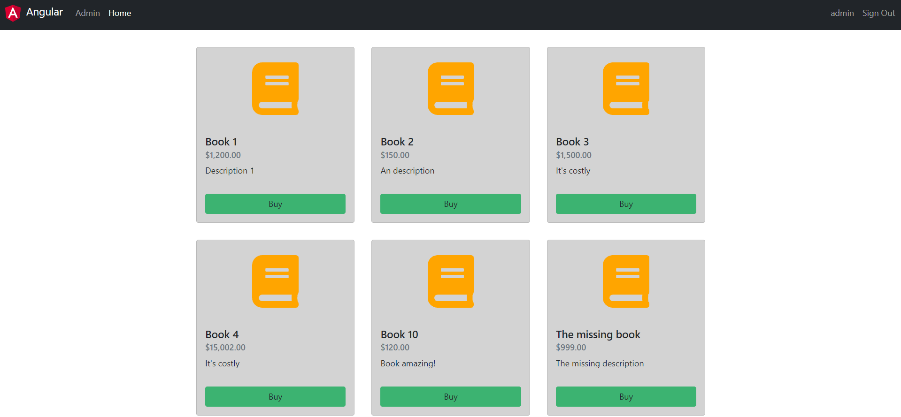
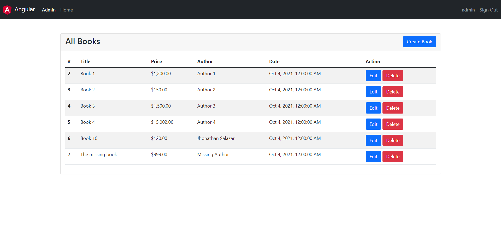

# Book Commerce Project 

A basic book commerce project with the following feature:
1. User sign-up and sign-in.
2. Books management (create, edit, delete).
3. Book seller.

Features are enabled with roles based (Users, Admin).

The project consume an own-api project that you can see in [book-commerce-backend](https://github.com/JhonathanAlfonso/bookcommerce-backend), in this project are enabled the available end-points.

Project url: https://book-commerce.herokuapp.com/home

## Bootstrap users

### User
```
  user: alfonso
  password: alfonso
```

### Admin
```
  user: admin
  password: admin
```

## Project Screenshots

### Home and Profile (Guests, Users)





### Admin (Admins)



